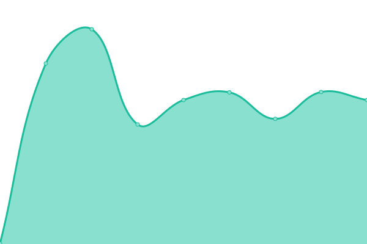
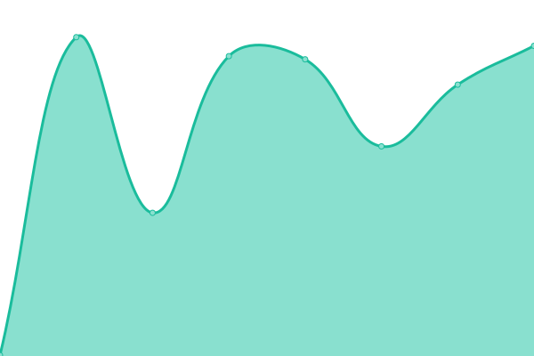

# [📈 Live Status](https://status.mcha.cloud): <!--live status--> **🟧 Partial outage**

**What is this page?**

mochaaNetwork provides open and flexible to users via its global network. This is the system status for the mochaaNetwork service, both edge network and public services.

<!--start: status pages-->
<!-- This summary is generated by Upptime (https://github.com/upptime/upptime) -->
<!-- Do not edit this manually, your changes will be overwritten -->
<!-- prettier-ignore -->
| URL | Status | History | Response Time | Uptime |
| --- | ------ | ------- | ------------- | ------ |
|  [Homepage](https://mochaa.ws) | 🟩 Up | [homepage.yml](https://github.com/mchaNetwork/status/commits/HEAD/history/homepage.yml) | 

 153ms
     
 | 

<a href="https://status.mcha.cloud/history/homepage">100.00%</a>
    

|  [Vault](https://vault.mcha.cloud) | 🟩 Up | [vault.yml](https://github.com/mchaNetwork/status/commits/HEAD/history/vault.yml) | 

 489ms
     
 | 

<a href="https://status.mcha.cloud/history/vault">100.00%</a>
    

|  [Insights](https://insights.mcha.cloud) | 🟥 Down | [insights.yml](https://github.com/mchaNetwork/status/commits/HEAD/history/insights.yml) | 

 0ms
     
 | 

<a href="https://status.mcha.cloud/history/insights">0.00%</a>
    

|  [Support](https://chat.mcha.cloud) | 🟥 Down | [support.yml](https://github.com/mchaNetwork/status/commits/HEAD/history/support.yml) | 

 0ms
     
 | 

<a href="https://status.mcha.cloud/history/support">0.00%</a>
    

|  [GitHub Mirror](https://gh.chapro.xyz) | 🟩 Up | [git-hub-mirror.yml](https://github.com/mchaNetwork/status/commits/HEAD/history/git-hub-mirror.yml) | 

 138ms
     
 | 

<a href="https://status.mcha.cloud/history/git-hub-mirror">100.00%</a>
    

|  [OpenWrt Mirror](https://mirrors.chapro.xyz/openwrt/) | 🟩 Up | [open-wrt-mirror.yml](https://github.com/mchaNetwork/status/commits/HEAD/history/open-wrt-mirror.yml) | 

 798ms
     
 | 

<a href="https://status.mcha.cloud/history/open-wrt-mirror">100.00%</a>
    

|  [Wikipedia Mirror](http://www.wp.chapro.xyz/) | 🟩 Up | [wikipedia-mirror.yml](https://github.com/mchaNetwork/status/commits/HEAD/history/wikipedia-mirror.yml) | 

 279ms
     
 | 

<a href="https://status.mcha.cloud/history/wikipedia-mirror">100.00%</a>
    

|  [Captive Portal](https://captive.mcha.cloud/generate/android) | 🟩 Up | [captive-portal.yml](https://github.com/mchaNetwork/status/commits/HEAD/history/captive-portal.yml) | 

 94ms
     
 | 

<a href="https://status.mcha.cloud/history/captive-portal">100.00%</a>
    

<!--end: status pages-->

[**Visit our status website →**](https://status.mcha.cloud)

## 📄 License

- Code: [MIT](./LICENSE) © [mochaaNetwork](https://mcha.network)
- Data in the `./history` directory: [Open Database License](https://opendatacommons.org/licenses/odbl/1-0/)
