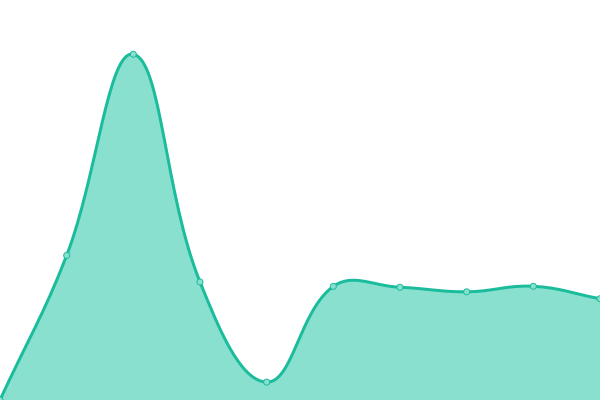

# [📈 Live Status](https://status.mcha.cloud): <!--live status--> **🟧 Partial outage**

**What is this page?**

mochaaNetwork provides open and flexible to users via its global network. This is the system status for the mochaaNetwork service, both edge network and public services.

<!--start: status pages-->
<!-- This summary is generated by Upptime (https://github.com/upptime/upptime) -->
<!-- Do not edit this manually, your changes will be overwritten -->
<!-- prettier-ignore -->
| URL | Status | History | Response Time | Uptime |
| --- | ------ | ------- | ------------- | ------ |
|  [homepage](https://mochaa.ws) | 🟩 Up | [homepage.yml](https://github.com/mchaNetwork/status/commits/HEAD/history/homepage.yml) | 

 456ms
     
 | 

<a href="https://status.mcha.cloud/history/homepage">100.00%</a>
    

|  [insights](https://insights.mcha.cloud/healthz) | 🟥 Down | [insights.yml](https://github.com/mchaNetwork/status/commits/HEAD/history/insights.yml) | 

 825ms
     
 | 

<a href="https://status.mcha.cloud/history/insights">99.43%</a>
    

|  [searcha](https://sear.mcha.cloud/healthz) | 🟩 Up | [searcha.yml](https://github.com/mchaNetwork/status/commits/HEAD/history/searcha.yml) | 

 1355ms
     
 | 

<a href="https://status.mcha.cloud/history/searcha">100.00%</a>
    

|  [wakapi](https://waka.mcha.cloud/api/health) | 🟩 Up | [wakapi.yml](https://github.com/mchaNetwork/status/commits/HEAD/history/wakapi.yml) | 

 863ms
     
 | 

<a href="https://status.mcha.cloud/history/wakapi">100.00%</a>
    

|  [GitHub Mirror](https://gh.chapro.xyz) | 🟩 Up | [git-hub-mirror.yml](https://github.com/mchaNetwork/status/commits/HEAD/history/git-hub-mirror.yml) | 

 284ms
     
 | 

<a href="https://status.mcha.cloud/history/git-hub-mirror">100.00%</a>
    

|  [Wikipedia Mirror (Wikiless)](https://wei-ji.eu.org/) | 🟩 Up | [wikipedia-mirror-wikiless.yml](https://github.com/mchaNetwork/status/commits/HEAD/history/wikipedia-mirror-wikiless.yml) | 

 420ms
     
 | 

<a href="https://status.mcha.cloud/history/wikipedia-mirror-wikiless">100.00%</a>
    

|  [Twitter Mirror (Nitter)](https://tui-te.eu.org/Jack/status/20) | 🟩 Up | [twitter-mirror-nitter.yml](https://github.com/mchaNetwork/status/commits/HEAD/history/twitter-mirror-nitter.yml) | 

 966ms
     
 | 

<a href="https://status.mcha.cloud/history/twitter-mirror-nitter">100.00%</a>
    

|  [Reddit Mirror (Redlib)](https://hong-di.eu.org/) | 🟩 Up | [reddit-mirror-redlib.yml](https://github.com/mchaNetwork/status/commits/HEAD/history/reddit-mirror-redlib.yml) | 

 2032ms
     
 | 

<a href="https://status.mcha.cloud/history/reddit-mirror-redlib">98.99%</a>
    

|  Yet Another LLM UI | 🟩 Up | [yet-another-llm-ui.yml](https://github.com/mchaNetwork/status/commits/HEAD/history/yet-another-llm-ui.yml) | 

 390ms
     
 | 

<a href="https://status.mcha.cloud/history/yet-another-llm-ui">100.00%</a>
    

<!--end: status pages-->

[**Visit our status website →**](https://status.mcha.cloud)

## 📄 License

- Code: [MIT](./LICENSE) © [mochaaNetwork](https://mcha.network)
- Data in the `./history` directory: [Open Database License](https://opendatacommons.org/licenses/odbl/1-0/)
